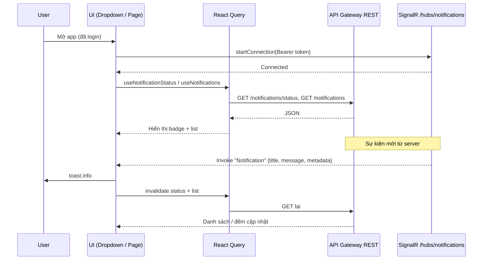

# Thông báo (Notifications) và SignalR

Tài liệu mô tả **cách notification trong client tương tác với backend**: phần nào dùng **HTTP (REST)** và phần nào dùng **SignalR hub**; cấu trúc file liên quan; luồng dữ liệu khi có push realtime.

---

## 1. Tổng quan: mô hình hybrid

| Kênh | Vai trò |
|------|---------|
| **REST** (`api8080Service` → `NEXT_PUBLIC_API_URL_API_GATEWAY`) | Đọc danh sách, chi tiết, trạng thái đếm chưa đọc; đánh dấu đã đọc. Đây là **nguồn dữ liệu chính** hiển thị trên UI. |
| **SignalR** | **Push realtime**: server gọi method xuống client khi có sự kiện mới; client **không** dùng hub để lấy full list — chỉ **toast + làm mới cache** (invalidate React Query). |

Client **không** merge payload SignalR vào store thủ công: sau mỗi push, các query `["notifications", "status"]` và `["notifications", "list"]` bị invalidate để **GET lại** từ API.

---

## 2. Cấu trúc file (tham chiếu nhanh)

```text
hubs/notificationHub.ts          # Singleton kết nối SignalR, URL hub, subscribe/off
hooks/useNotification.ts         # React Query (REST) + useNotificationListener (SignalR)
lib/api/services/fetchNotification.ts   # NotificationService + type InAppNotificationPayload
app/(auth)/providers/AuthProvider.tsx   # Gọi useNotificationListener() khi app có auth
components/widget/notification/NotificationDropdown.tsx   # Badge + list (REST)
app/(notifications)/notifications/*.tsx                  # Trang danh sách / chi tiết
```

---

## 3. REST — API và React Query

**Base URL:** `NEXT_PUBLIC_API_URL_API_GATEWAY` (cùng instance `api8080Service`, có `Authorization: Bearer` sau khi `AuthProvider` set token).

| Method | Endpoint | Hook / usage |
|--------|----------|----------------|
| GET | `/api/v1/notifications/status` | `useNotificationStatus` — `unReadCount`, `hasUnread`; **refetch mỗi 30s** |
| GET | `/api/v1/notifications` | `useNotifications` — danh sách phân trang |
| GET | `/api/v1/notifications/{id}` | `useNotificationById` — chi tiết |
| POST | `/api/v1/notifications/read-all` | `useMarkAllAsRead` |
| POST | `/api/v1/notifications/{id}/read` | `useMarkAsRead` |

**Map UI:** `mapApiNotificationToNotification` trong `useNotification.ts` chuyển `entityType` (ví dụ `MaintenanceReminder`, `OdometerReminder`) sang `type` nội bộ (`reminder`, `odometer_update`, …) để icon và navigation thống nhất.

---

## 4. SignalR — Hub

### 4.1 URL và auth

- **Hub URL:** `{NEXT_PUBLIC_API_URL_API_GATEWAY}/hubs/notifications`
- **Xác thực:** `accessTokenFactory` trả về JWT; token lấy từ auth context (`useAuth().accessToken`), trùng luồng đăng nhập với REST.

### 4.2 Client (`hubs/notificationHub.ts`)

- Dùng `@microsoft/signalr`: `HubConnectionBuilder`, WebSockets / SSE / LongPolling.
- `withAutomaticReconnect`: delay 2s (3 lần đầu) rồi 5s.
- Singleton `notificationHubService`:
  - `startConnection(accessToken, onNotification?)` — `start()` rồi subscribe method server.
  - `on(methodName, callback)` / `off(methodName, callback?)`
  - `getConnectionState()` — `isConnected`, `isConnecting`, `error`

### 4.3 Method server → client

| Tên method (server invoke xuống client) | Payload (client expect) |
|----------------------------------------|-------------------------|
| `Notification` | Tham số đầu tiên cast thành `InAppNotificationPayload`: `{ title, message, metadata }` |

Định nghĩa type: `lib/api/services/fetchNotification.ts` → `InAppNotificationPayload`.

---

## 5. Luồng tương tác: `useNotificationListener`

**File:** `hooks/useNotification.ts` — hook `useNotificationListener`.

**Khi nào chạy:** Được gọi trong `AuthProvider` (sau khi user có phiên đăng nhập / token).

**Điều kiện:** Chỉ subscribe khi `accessToken` truthy.

**Khi nhận message hub (`Notification`):**

1. Log console (debug).
2. Nếu có `title` và `message` → `toast.info(title, { description: message })`.
3. `queryClient.invalidateQueries({ queryKey: ["notifications", "status"] })`
4. `queryClient.invalidateQueries({ queryKey: ["notifications", "list"] })`

→ UI badge và dropdown/list **tự refetch** REST; không cần backend gửi full object notification trong SignalR (chỉ cần đủ để toast + trigger refresh).

**Kết nối:**

- Nếu hub đã connected → chỉ `on("Notification", handler)`.
- Nếu đang connecting → đợi / gọi `startConnection(token, handler)`.
- Nếu chưa kết nối → `startConnection(token, handler)` (callback vừa start vừa subscribe).

**Cleanup:** `off("Notification", handler)` khi unmount hoặc đổi token.

---

## 6. Sơ đồ luồng (tóm tắt)



---

## 7. Ghi chú triển khai / port sang project khác

1. **Cùng base URL gateway** cho REST và hub path `/hubs/notifications`.
2. **Token:** Hub và REST phải dùng cùng cơ chế JWT; nếu token refresh, cần đảm bảo `useNotificationListener` chạy lại effect với token mới (đã có dependency `[accessToken, queryClient]`).
3. **SignalR không thay REST:** Danh sách chi tiết luôn lấy từ GET; push chỉ báo “có tin mới” + refresh.
4. **Polling phụ:** `useNotificationStatus` có `refetchInterval: 30000` — kể cả khi SignalR lỗi, badge vẫn có thể cập nhật chậm qua polling (tùy UX có thể tắt nếu chỉ tin SignalR).
5. **Reconnect:** Sau `onreconnected`, code hiện có ghi chú có thể cần subscribe lại handler nếu server không giữ subscription — cần kiểm chứng với backend ASP.NET Core SignalR.

---

## 8. Biến môi trường liên quan

| Biến | Ý nghĩa |
|------|---------|
| `NEXT_PUBLIC_API_URL_API_GATEWAY` | Base URL cho cả REST notification và hub `.../hubs/notifications` |

Cookie `auth-token` + `api8080Service.setAuthToken` dùng cho REST; hub dùng `accessToken` từ `useAuth()` trong listener.
